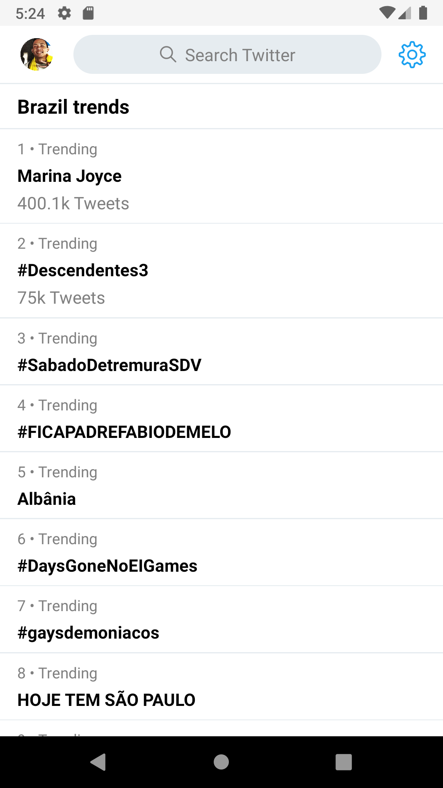
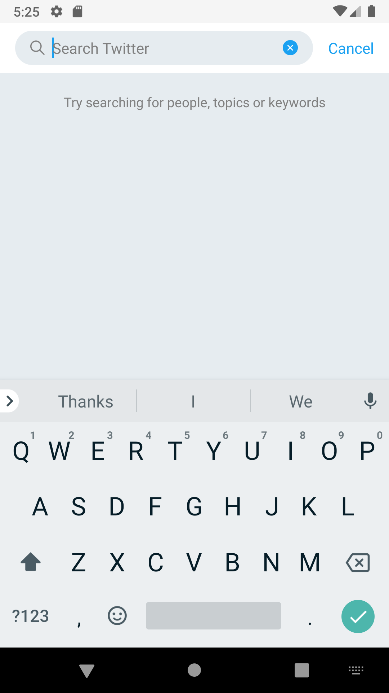
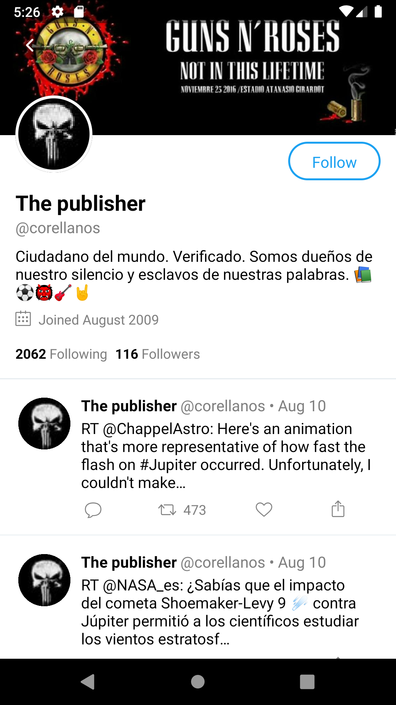

# TwitterClone


[Click here to see the app running on iOS device](https://drive.google.com/file/d/1MT7pjoa2l_cWUggpxH-4aZc83xFO0eLf/view?usp=sharing) :heart:

## Description

Simple Twitter clone using React Native

## Prerequisites

- Follow these steps to install [React Native](https://facebook.github.io/react-native/docs/getting-started) and all the others things that you need
- [Yarn](https://yarnpkg.com/lang/en/docs/install/) or [NPM](https://www.npmjs.com/)

## Get Started

Open your command prompt and run the following commands:

```
$ git clone https://github.com/alvesmarcos/TwitterClone.git

$ cd TwitterClone/

$ yarn install or npm install
```

* To run on iOS simulator/device
```
  $ react-native run-ios
```

* To run on Android simulator/device
```
  $ react-native run-android
```

## Screenshots

### Android (Light mode)

 

 

## iOS (Dark mode)

 

 


## References

* https://facebook.github.io/react-native/docs/getting-started
* https://github.com/fangwei716/30-days-of-react-native
* https://facebook.github.io/react-native/blog/2018/01/18/implementing-twitters-app-loading-animation-in-react-native
* https://reactnativeexample.com/twitter-header-scroll-animation-in-react-native/
